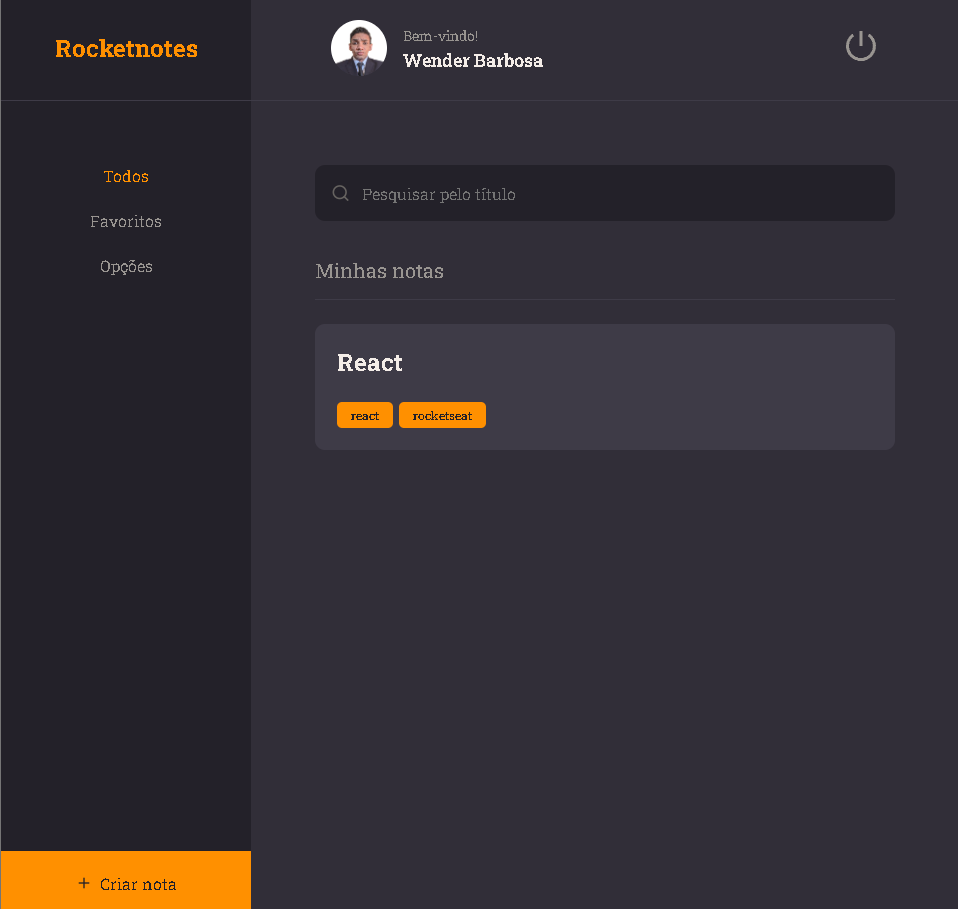

<h1 align="center">
 Rocket Notes
</h1>

<p align="center">Aplicação para salvar e gerenciar seus links úteis</p>

<p align="center">
  

  <a href="https://www.linkedin.com/in/wender-jose-santos-4b1473217/">
    
  </a>
  
  
  
  <a href="https://github.com/wenblack/rocketNotes2/commits/master">
    
  </a>
  
  <a href="https://github.com/wenblack/rocketNotes2/issues">
    
  </a>
  
  
</p>

---

<div align="center">

 
</div>
<p align="center">
  <a href="#-about-the-project">About the project</a>&nbsp;&nbsp;&nbsp;|&nbsp;&nbsp;&nbsp;
  <a href="#-technologies">Technologies</a>&nbsp;&nbsp;&nbsp;|&nbsp;&nbsp;&nbsp;
  <a href="#-getting-started">Getting started</a>&nbsp;&nbsp;&nbsp;|&nbsp;&nbsp;&nbsp;
  <a href="#-how-to-contribute">How to contribute</a>&nbsp;&nbsp;&nbsp;|&nbsp;&nbsp;&nbsp;
  <a href="#-license">License</a>
</p>

## 👨🏻‍💻 About the project

- <p style="color: red;">Layout of App to save and manage your links with notes
  </p>

## 🚀 Technologies

Technologies that I used to develop this web client

- [ReactJS](https://reactjs.org/)
- [React Router DOM](https://reacttraining.com/react-router/)
- [React Icons](https://react-icons.netlify.com/#/)
- [Styled Components](https://styled-components.com/)
- [Prettier](https://prettier.io/)

## 💻 Getting started

### Requirements

**Clone the project and access the folder**

```bash
$ git clone https://github.com/wenblack/rocketNotes2.git && cd rocketNotes2
```

**Follow the steps below**

```bash
# Install the dependencies
$ yarn

# Start the client
$ yarn dev
```

## 🤔 How to contribute

**Make a fork of this repository**

```bash
# Fork using GitHub official command line
# If you don't have the GitHub CLI, use the web site to do that.

$ gh repo fork wenblack/rocketNotes2
```

**Follow the steps below**

```bash
# Clone your fork
$ git clone your-fork-url && cd wenblack/rocketNotes2

# Create a branch with your feature
$ git checkout -b my-feature

# Make the commit with your changes
$ git commit -m 'feat: My new feature'

# Send the code to your remote branch
$ git push origin my-feature
```

After your pull request is merged, you can delete your branch

## 📝 License

This project is licensed under the MIT License - see the [LICENSE](LICENSE) file for details.

---

Made with 💜 &nbsp;by Wen barbosa 👋 &nbsp;[See my linkedin](https://www.linkedin.com/in/wender-jose-santos-4b1473217/)
